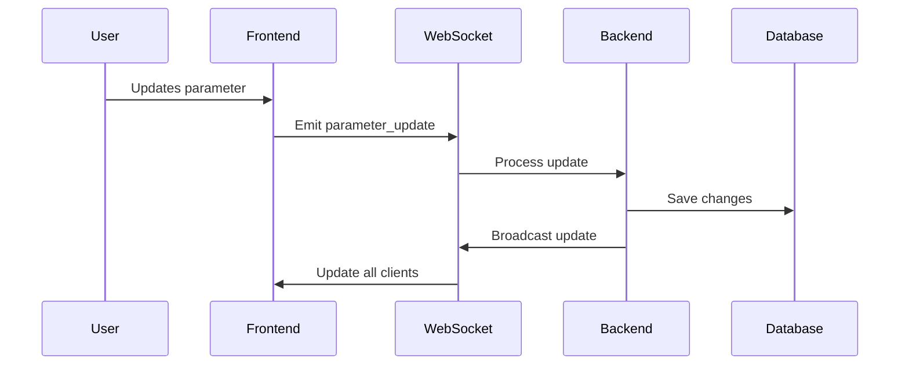
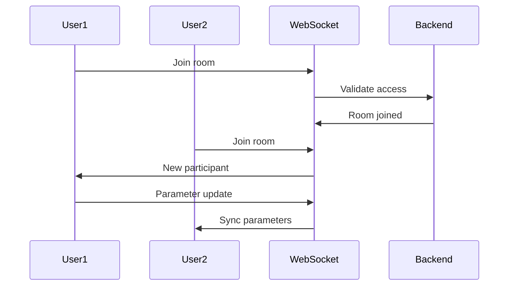

# Harmonic Universe Architecture

## System Overview

Harmonic Universe is a real-time interactive application that combines physics simulation, music generation, and visualization. The system is built using a microservices-inspired architecture with the following main components:

```
┌─────────────────┐     ┌──────────────────┐     ┌────────────────┐
│  React Frontend │◄────┤ WebSocket Server │────►│ Flask Backend  │
└─────────────────┘     └──────────────────┘     └────────────────┘
         ▲                       ▲                        ▲
         │                       │                        │
         ▼                       ▼                        ▼
┌─────────────────┐     ┌──────────────────┐     ┌────────────────┐
│  Redux Store    │     │ Event Bus        │     │   Database     │
└─────────────────┘     └──────────────────┘     └────────────────┘
```

## Core Components

### Frontend Architecture

1. **React Components**

   - `UniverseBuilderPage`: Main universe creation/editing interface
   - `PhysicsControls`: Physics parameter management
   - `MusicControls`: Music parameter management
   - `VisualizationControls`: Visualization parameter management

2. **State Management**

   - Redux store with slices for:
     - Universe state
     - Physics parameters
     - Music parameters
     - Visualization parameters
     - WebSocket connection state
     - User authentication

3. **WebSocket Client**
   - Manages real-time connections
   - Handles parameter synchronization
   - Manages collaboration features

### Backend Architecture

1. **Flask Application**

   - RESTful API endpoints
   - WebSocket server
   - Authentication middleware
   - Parameter validation
   - Database models and migrations

2. **Services**

   - `PhysicsService`: Physics simulation calculations
   - `MusicService`: Music generation and audio processing
   - `VisualizationService`: Particle system and rendering
   - `AIService`: Parameter optimization and suggestions
   - `WebSocketService`: Real-time communication management

3. **Database Models**
   - `User`: User authentication and profiles
   - `Universe`: Core universe properties
   - `PhysicsParameters`: Physics simulation settings
   - `MusicParameters`: Music generation settings
   - `VisualizationParameters`: Visual rendering settings

## Data Flow

### Parameter Updates



### Real-time Collaboration



## Parameter Integration

### Physics → Music Mapping

- Gravity affects tempo (higher gravity = faster tempo)
- Friction affects harmony (more friction = more harmonic)
- Density affects note density
- Elasticity affects note duration

### Music → Visualization Mapping

- Tempo affects particle speed
- Harmony affects color scheme
- Key affects particle rotation
- Scale affects particle distribution

### Physics → Visualization Mapping

- Gravity affects brightness
- Density affects particle count
- Air resistance affects trail length
- Friction affects particle blur

## Security

1. **Authentication**

   - JWT-based authentication
   - Token refresh mechanism
   - Rate limiting per user

2. **WebSocket Security**

   - Connection authentication
   - Room-based access control
   - Message validation

3. **API Security**
   - CORS configuration
   - Input validation
   - Parameter range enforcement

## Performance Considerations

1. **Frontend Optimization**

   - Debounced parameter updates
   - WebGL rendering for visualization
   - Web Audio API for music generation
   - Memoized React components

2. **Backend Optimization**

   - Connection pooling
   - Caching layer
   - Batch parameter updates
   - Async task processing

3. **WebSocket Optimization**
   - Binary message format
   - Message batching
   - Heartbeat mechanism
   - Reconnection strategy

## Development Workflow

1. **Local Development**

   ```bash
   # Terminal 1 - Backend
   cd backend
   ./setup.sh
   flask run

   # Terminal 2 - Frontend
   cd frontend
   npm install
   npm run dev
   ```

2. **Testing**

   ```bash
   # Run all tests
   ./test_runner.sh

   # Run specific tests
   cd backend && pytest tests/unit
   cd frontend && npm test
   ```

## Deployment

1. **Production Setup**

   - PostgreSQL database
   - Redis for caching
   - NGINX reverse proxy
   - SSL/TLS configuration

2. **Scaling Considerations**
   - Horizontal scaling of WebSocket servers
   - Database replication
   - Load balancing
   - CDN for static assets

## Monitoring

1. **Metrics**

   - WebSocket connection count
   - Parameter update frequency
   - Response times
   - Error rates

2. **Logging**
   - Application logs
   - WebSocket events
   - Performance metrics
   - Error tracking

## Future Considerations

1. **Planned Features**

   - Mobile support
   - Offline mode
   - Extended AI capabilities
   - Advanced visualization effects

2. **Technical Debt**
   - Performance optimization
   - Test coverage
   - Documentation updates
   - Code refactoring
